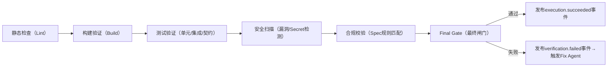

# 通用 Agent 系统框架（L0+L1）最终版（对齐大厂4大核心系统）

## 一、框架核心定位与设计原则

### 1.1 核心定位（收敛后）

本框架是**规则文件驱动的通用工程化 Agent 内核（L0）+ 角色化子 Agent 分工 + 全链路自动验证与治理 + 可插拔业务适配层（L1）**：

- L0 固化大厂验证的 4 大核心系统（Spec/Execution/Verification/Governance），定义“规则先于执行、沙箱隔离、自动验证、可观测治理”的通用工程化逻辑，100% 复用；

- L1 仅通过“规则文件配置+验证脚本补充+业务逻辑实现”适配具体场景，不修改 L0 内核结构与交互规则。

### 1.2 核心设计原则（强化+补充）

|原则名称|核心约束（L0 通用化表述）|对齐大厂实践|
|---|---|---|
|职责单一原则|每个 L0 子 Agent 仅负责单一角色（如编码/测试/修复）；4 大核心系统边界清晰，无职责交叉|GitHub/AWS 子 Agent 角色分工、Anthropic 规则与执行分离|
|复用性原则|L0 内核 100% 复用，L1 仅修改“业务规则文件+验证脚本+沙箱内业务逻辑”|Microsoft Copilot X/阿里灵码“通用内核+配置化适配”|
|规则先于执行原则|所有 Agent 执行必须基于 Spec 系统的规则文件，无规则不执行；规则修改需审批版本化|Google Gemini/Anthropic [CLAUDE.md](CLAUDE.md) 规则文件驱动|
|沙箱隔离原则|每 Agent/每任务运行在独立沙箱，沙箱内操作不跨域；执行结果仅通过产物引用 ID 输出|OpenAI 云沙箱、Anthropic 双重隔离|
|自动验证闭环原则|执行结果必须通过 Verification 系统全链路验证，失败触发自动修复，超重试上限触发人工闸门|GitHub CodeQL/阿里灵码自动化门禁|
|上下文产品化原则|执行上下文（代码索引/规则/记忆）版本化、可审计、基于 IAM 权限管控|Google 仓库索引、OpenAI 上下文记忆|
|原核心原则保留|事件驱动/读写分离/分片稳定/可中断可恢复/全链路可追溯/异常分类处理|原框架+大厂 Shard Manager/Checkpoint/Event Bus 实践|
## 二、L0 内核：4 大核心系统（收敛原三平面）

### 2.1 核心系统与原三平面的映射关系

|L0 4大核心系统|对应原框架模块|收敛核心逻辑|
|---|---|---|
|Spec System（规则定义系统）|原 L0 核心契约（UserRuleSet/ContractSpec）+ Rule Definition Agent|从“抽象规则集”落地为“仓库级规则文件驱动”，是所有执行的前置条件|
|Execution System（执行系统）|原 Build 平面事务型 Agent + Runtime 平面基础机制|移除万能/汇总类 Agent，固化角色化子 Agent，补充沙箱执行、上下文挂载|
|Verification System（验证系统）|原分散在 Build 平面的 Test/Review Agent|从“分散职责”升级为“独立验证流水线”，脱离 Build 平面成为内核级能力|
|Governance System（治理系统）|原 Governance 平面 + 权限/审计/分片/断点机制|整合沙箱隔离、上下文管控、可观测性、人类审批，成为全链路治理底座|
### 2.2 Spec System（规则定义系统）—— 执行的“前置总纲”

#### 核心使命

定义所有执行行为的规则边界，实现“规则文件化、版本化、机器可解析”，是 Execution/Verification/Governance 系统的输入依据。

#### 核心元结构（L0 固化，L1 仅补充字段）

|规则文件类型|L0 通用 Schema（元结构）|L1 适配方式|对齐大厂实践|
|---|---|---|---|
|RepoPolicy.yaml|`{ "rule_version": "string", "shard_affinity": "string", "resource_limits": "object", "compliance_base_rules": "array" }`|补充业务合规规则（如金融风控、电商隐私）|AWS Devfile、Google `.gemini/repo_policy.yaml`|
|ToolPolicy.yaml|`{ "allowlist": "array", "denylist": "array", "permission_scope": "string" }`|补充业务工具白名单（如金融风控工具、电商接口）|Anthropic 工具权限管控、OpenAI 插件白名单|
|ContractSpec.json|保留原通用结构（input_ref/output_ref/shard_id 等）|补充业务字段（如电商订单字段、金融交易字段）|原框架契约+Google 接口契约规范|
|[StyleGuide.md](StyleGuide.md)|`{ "language_rules": "object", "format_rules": "object", "review_checkpoints": "array" }`|补充业务编码风格（如金融代码注释规范）|GitHub 代码风格指南、阿里灵码编码规范|
|TestTargets.yaml|`{ "unit_test": "object", "integration_test": "object", "contract_test": "object" }`|补充业务测试用例、测试命令|Microsoft Copilot X 测试目标定义|
#### 核心 Agent（仅规则解析，不参与执行）

|Agent 名称|核心职责|边界约束|
|---|---|---|
|Rule Parser Agent|解析规则文件 → 机器可执行规则集|仅解析/校验规则语法，不修改规则内容|
|Rule Version Agent|规则文件版本管理、变更审批|仅版本记录/审批流触发，不参与规则执行|
### 2.3 Execution System（执行系统）—— 业务的“原子执行单元”

#### 核心使命

基于 Spec System 的规则，通过角色化子 Agent 完成“需求→产物”的工程化转化，所有执行行为在 L0 定义的沙箱内完成。

#### 核心调整（原 Build/Runtime 平面收敛）

1. **角色化子 Agent 集（L0 固化，禁止万能 Agent）**

|子 Agent 角色|核心职责（通用化）|对应原模块|新增/保留|对齐大厂实践|
|---|---|---|---|---|
|Requirement Analysis Agent|需求解析→工程化规格|原 Build 平面|保留|Google Codey 需求解析|
|Architecture Design Agent|通用架构设计→模块划分|原 Build 平面|保留|阿里灵码架构设计|
|Development Agent|基于架构/契约编写代码|原 Build 平面|保留|Microsoft Copilot X 代码生成|
|Fix Agent|验证失败后自动修复已知问题|新增|新增|GitHub 自动修复、AWS CodeGuru|
|Security Scan Agent|代码安全漏洞扫描（通用规则）|新增|新增|GitHub CodeQL、阿里灵码安全扫描|
|Deploy Agent|沙箱内部署→产物生成|原 Build 平面|保留|Google 沙箱部署、字节火山引擎部署|
|Release Agent|灰度发布/回滚（沙箱验证后）|原 Build 平面|保留|Microsoft 灰度发布、阿里云效发布|
|移除项|Build Summary Agent 等汇总类 Agent|-|移除|下沉为 Verification 系统报告能力|
1. **核心运行机制（L0 固化）**

- 沙箱执行：每个 Agent 任务分配独立沙箱（`sandbox_id` 关联 Shard Manager），沙箱隔离级别（文件/网络/资源）由 Spec System 定义；

- 上下文挂载：执行前自动挂载 Spec 规则、仓库索引、团队记忆（Context 层）；

- 事件驱动：跨 Agent 交互仅通过 Event Bus（如 `verification.failed` 触发 Fix Agent）；

- 分片执行：Shard Manager 负责 Agent/沙箱的负载均衡，避免热点；

- 断点续跑：Checkpoint 包含沙箱状态快照，故障后重建沙箱恢复执行。

### 2.4 Verification System（验证系统）—— 质量的“自动化闸门”

#### 核心使命

独立于执行流程，对 Execution 系统的产物进行全链路自动验证，实现“质量兜底无人工”。

#### 核心验证流水线（L0 固化流程，L1 仅替换脚本）


#### 核心能力（L0 固化）

- 流水线结果写入 Write Model，仅通过事件触发后续流程；

- 验证规则与 Spec System 强绑定，规则版本不一致直接阻断；

- 自动修复重试上限（L0 默认为 3 次），超上限触发 Governance 系统的人类闸门；

- 验证报告标准化，自动归集至 Read Model 用于可观测面板。

### 2.5 Governance System（治理系统）—— 全局的“管控底座”

#### 核心使命

跨 Spec/Execution/Verification 系统的全局治理，实现“隔离、可观测、可审计、可管控”。

#### 核心模块（L0 固化，L1 无修改权限）

|模块名称|核心元模型（L0 通用）|核心能力|对齐大厂实践|
|---|---|---|---|
|Sandbox Manager|`{ "sandbox_id": "string", "isolation_level": "file/network/resource", "resource_limits": "object", "agent_id": "string" }`|沙箱分配/隔离/销毁，关联 Shard Manager|OpenAI 云沙箱、Anthropic 双重隔离|
|Context/Memory Layer|`{ "index_version": "string", "iam_roles": "array", "exclude_rules": ".aiexclude", "team_memory": "object" }`|仓库索引、权限管控、团队记忆沉淀|Google 仓库索引、OpenAI 上下文记忆|
|Observability Module|`{ "metrics": "object（执行时长/失败率/通过率）", "trace_id": "string", "audit_log": "object" }`|监控指标、全链路追溯、治理大屏|OpenAI 监控面板、阿里云效审计|
|Human Approval Module|保留原 Human Approval Checkpoint 结构，新增沙箱快照关联|标准化审批节点（Release 前/Final Gate 失败后）、审批记录审计|GitHub PR 审批、Google 人工审查|
|Shard/Checkpoint/读写分离|保留原机制，补充沙箱/上下文关联|分片负载均衡、断点续跑、读写隔离|原框架+字节火山引擎分片实践|
## 三、L0 内核关键强化机制（大厂验证核心）

|强化机制|L0 通用实现逻辑|价值|
|---|---|---|
|沙箱隔离|1. 定义 `sandbox_id` 全局唯一；<br>2. 沙箱隔离级别：文件（仅访问指定目录）、网络（仅白名单域名）、资源（CPU/内存上限）；<br>3. 沙箱内产物仅通过 `output_ref` 输出，禁止跨沙箱读写|故障隔离、合规管控，对齐 Anthropic/OpenAI 隔离实践|
|上下文/记忆层|1. 仓库级代码索引（版本化）；<br>2. IAM 角色管控上下文访问权限；<br>3. `.aiexclude` 定义上下文排除规则；<br>4. 沉淀人类审批/Agent 修复记录为团队记忆|执行效率提升、知识复用，对齐 Google/OpenAI 上下文实践|
|自动修复闭环|1. Verification 失败 → 发布 `verification.failed` 事件；<br>2. Fix Agent 基于规则/记忆自动修复；<br>3. 修复后重新触发 Verification；<br>4. 超 3 次重试触发人类闸门|减少人工介入，对齐 GitHub/AWS 自动修复实践|
|规则文件版本化|1. 所有规则文件绑定 `rule_version`；<br>2. 规则修改需通过 Governance 审批；<br>3. Agent 执行绑定固定规则版本，避免执行中规则变更|可追溯、可回滚，对齐 Google/Meta 规则版本管理|
## 四、L1 业务插件适配规则（配置化为主，无内核修改）

### 4.1 L1 仅需提供的适配内容

|适配类型|示例（合规资讯源场景）|约束|
|---|---|---|
|业务规则文件|补充 `RepoPolicy.yaml` 资讯源合规规则、`ToolPolicy.yaml` 资讯抓取工具白名单|仅补充字段，不修改 L0 定义的 Schema 结构|
|验证脚本|替换 TestTargets.yaml 中的资讯内容校验脚本、合规扫描脚本|仅替换脚本内容，不修改 Verification 流水线流程|
|业务逻辑实现|Resource Runtime Agent 实现资讯抓取逻辑（运行在 L0 沙箱内）|仅实现沙箱内业务逻辑，调用工具需在 ToolPolicy 白名单内|
|修复规则|补充资讯抓取失败的自动修复模板（如重试策略、源站切换）|仅补充修复规则，不修改 Fix Agent 执行逻辑|
### 4.2 L1 严格禁止的操作

1. 修改 L0 4 大核心系统的元结构；

2. 新增/删除 L0 定义的子 Agent 角色；

3. 修改 Verification 流水线的执行顺序；

4. 突破 L0 沙箱隔离规则（如跨沙箱读写）；

5. 直接修改 L0 Event Bus 交互规则。

## 五、从原三平面到 4 大核心系统的收敛逻辑（核心对齐）

|原三平面|收敛到 4 大系统的逻辑|核心优化点|
|---|---|---|
|Build 平面|1. 规则定义部分 → Spec System；<br>2. 执行类 Agent（开发/部署/发布）→ Execution System；<br>3. 测试/评审部分 → Verification System；<br>4. 审计/权限部分 → Governance System|拆分“规则-执行-验证”，避免职责混杂；移除无明确职责的汇总类 Agent|
|Runtime 平面|1. 运行机制（事件/分片/断点）→ Execution System 运行层；<br>2. 业务 Runtime Agent → L1 插件；<br>3. 沙箱/上下文 → Governance System|固化通用运行机制，下沉业务逻辑至 L1，补充沙箱隔离|
|Governance 平面|1. 合规/审计 → Governance System；<br>2. Final Gate → Verification System；<br>3. 人类审批 → Governance System|整合沙箱/上下文/可观测性，从“抽象治理”落地为“产品化治理能力”|
## 六、落地优先级（先固化内核，再补适配）

|阶段|核心落地内容|验收标准|
|---|---|---|
|第一阶段|固化 L0 4 大核心系统元结构：<br>1. Spec System 规则文件 Schema；<br>2. Execution System 角色化子 Agent；<br>3. Verification System 基础验证流水线；<br>4. Governance System 基础审计/分片机制|L0 内核可独立运行，支持空规则下的通用执行流程|
|第二阶段|补充 L0 核心强化机制：<br>1. 沙箱隔离；<br>2. 上下文/记忆层；<br>3. 自动修复闭环；<br>4. 规则文件版本化|执行过程可隔离、可追溯、失败可自动修复|
|第三阶段|L1 业务插件适配：<br>1. 配置业务规则文件；<br>2. 补充验证脚本/业务逻辑；<br>3. 验证“L0 100% 复用”|业务场景可落地，修改仅在 L1 层，无需改动 L0 代码|
|第四阶段|强化 Governance 可观测性：<br>1. 监控指标面板；<br>2. 管理员配置界面；<br>3. 全链路审计大屏|支持可视化管控、问题快速定位、合规审计|
## 最终框架核心链路（对齐大厂真实落地）

```Plain Text

规则文件（Spec System）→ 角色化子 Agent 沙箱执行（Execution System）→ 全链路自动验证（Verification System）→ 沙箱/上下文/审计治理（Governance System）→ 人类审批（可选）→ 产物输出
```

该框架既保留原“L0 通用内核+L1 插件化”的核心优势，又完全对齐 Anthropic/GitHub/AWS/Google/OpenAI 的工程化实践，无“万能 Agent”“模糊职责”等反模式，可直接落地为可执行的 Agent 系统架构。
> （注：文档部分内容可能由 AI 生成）