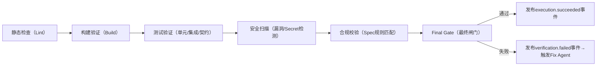

# 通用 Agent 系统框架（L0 + L1）深度解析

# 通用 Agent 系统框架（L0 + L1）解析

# 一、通用 Agent 系统工程框架（L0 内核 + L1 独立业务仓库版）

## 框架最终定位

本框架是**与业务完全解耦的 Agent 系统工程内核（L0）** + **完全独立的业务应用仓库（L1）**。L0 只定义所有系统工程场景通用的 Agent 元模型、生命周期、运行机制、协同规则、SDK/API 与运行时基础设施；L1 业务应用必须位于独立仓库，通过依赖管理方式引入 L0 内核，并在自己的仓库中实现业务 Agent、业务规则、业务前后端与部署逻辑。核心目标是「内核复用 100%，业务仓库独立演进，技术栈自由选择」。

## 目录结构（内核仓库 + 独立业务仓库）

```Plain Text

agent-system-framework/      # 仓库 1：L0 纯内核库，100% 无业务代码
  src/
    agent_system_framework/  # Python 参考实现的源码根目录
      core/                  # 核心契约与模型（纯抽象定义）
        agent_meta_model/    # Agent 元模型定义（接口/Protocol）
        state_schema/        # 全局状态 Schema 定义
        lifecycle/           # Agent 生命周期状态机
        idempotency/         # 幂等性抽象接口
        permission/          # 权限模型抽象
      spec_system/           # 规则定义系统（Spec System）
        parser/              # 规则文件解析器
        version_manager/     # 规则版本管理
        schema/              # 规则文件 Schema 定义
      execution_system/      # 执行系统（Execution System）
        sandbox/             # 沙箱执行抽象层
        agent_pool/          # 角色化子 Agent 抽象基类
        context/             # 上下文挂载机制
      verification_system/   # 验证系统（Verification System）
        pipeline/            # 验证流水线抽象
        gates/               # 质量闸门抽象接口
      governance_system/     # 治理系统（Governance System）
        sandbox_manager/     # 沙箱管理器
        observability/       # 可观测性抽象
        audit/               # 审计日志抽象
        human_approval/      # 人工审批抽象接口
      runtime_engine/        # 通用运行引擎
        event_bus/           # 事件总线实现
        read_write_sep/      # 读写分离实现
        shard_manager/       # 分片管理器
        checkpoint/          # 断点续跑机制
      sdk/                   # 多语言 SDK 定义（仅接口/IDL）
        proto/               # Protocol Buffers / Thrift 定义
        python/              # Python SDK 接口
        typescript/          # TypeScript SDK 接口
        java/                # Java SDK 接口
        go/                  # Go SDK 接口
  docs/                      # 内核文档
    architecture/            # 架构文档
    api/                     # API 参考
    examples/                # 纯内核使用示例（无业务）
  tests/                     # 内核测试

business-app-finance/        # 仓库 2：L1 金融业务应用（独立仓库）
  backend/                   # 业务后端（语言自选）
  frontend/                  # 业务前端（技术栈自选）
  deploy/                    # 部署配置

business-app-ecommerce/      # 仓库 3：L1 电商业务应用（独立仓库）
  backend/
  frontend/
  deploy/
```

### 关键调整说明

1. `agent-system-framework/` 是纯内核库，不再包含任何业务示例代码。
2. `sdk/` 只保留接口、IDL 和协议定义，不内置业务实现。
3. `docs/examples/` 仅展示纯内核 API 用法，不承载业务产品示例。
4. 每个业务场景必须在独立仓库中实现，按自己的技术栈组织前后端与部署。
5. 业务仓库通过 `pip / npm / maven / go mod` 等依赖管理方式引入内核。
6. 业务逻辑通过继承内核抽象基类、实现 SDK 接口、遵循统一规则文件格式来接入。

## 第一章：框架核心定位与设计原则（L0 纯通用）

### 1.1 框架定位

L0 是**系统工程领域的 Agent 通用运行时内核**，定义「Agent 该如何存在、交互、运行、被治理」的通用规则，不绑定任何业务场景；L1 是业务插件层，通过 SDK 将具体业务（资讯源、电商、金融）映射到 L0 内核的通用模型上，实现「内核不变，业务可插拔」。

### 1.2 核心设计原则（强化内核约束）

|原则名称|核心约束（L0 通用化表述）|
|---|---|
|职责单一原则|每个 L0 Agent 仅负责系统工程原子环节，无业务逻辑；L1 业务Agent仅扩展业务逻辑，不修改内核交互规则|
|复用性原则|L0 内核 100% 复用，L1 仅修改「业务规则集+产物映射+content逻辑」|
|用户最小干预原则|同原规则（规则定义/审批/结果校验）|
|全链路可追溯原则|同原规则（日志/版本/引用）|
|异常分类处理原则|同原规则（瞬时/确定性/外部变化/合规违规）|
|可中断可恢复原则|基于 Checkpoint + Shard Manager 实现，支持分片级恢复|
|规则统一原则|L0 定义规则元结构，L1 仅扩展业务规则字段，无结构冲突|
|事件驱动原则|跨Agent交互仅通过 Event Bus 实现，禁止直接调用|
|读写分离原则|Write Model 负责状态写入，Read Model 负责查询/看板，互不干扰|
|分片稳定原则|基于 Shard Manager 实现 Agent 负载均衡，避免热点与崩溃|
### 1.3 核心设计原则（强化+补充，对齐大厂实践）

|原则名称|核心约束（L0 通用化表述）|对齐大厂实践|
|---|---|---|
|职责单一原则|每个 L0 子 Agent 仅负责单一角色（如编码/测试/修复）；4 大核心系统边界清晰，无职责交叉|GitHub/AWS 子 Agent 角色分工、Anthropic 规则与执行分离|
|复用性原则|L0 内核 100% 复用，L1 仅修改“业务规则文件+验证脚本+沙箱内业务逻辑”|Microsoft Copilot X/阿里灵码“通用内核+配置化适配”|
|规则先于执行原则|所有 Agent 执行必须基于 Spec 系统的规则文件，无规则不执行；规则修改需审批版本化|Google Gemini/Anthropic [CLAUDE.md](CLAUDE.md) 规则文件驱动|
|沙箱隔离原则|每 Agent/每任务运行在独立沙箱，沙箱内操作不跨域；执行结果仅通过产物引用 ID 输出|OpenAI 云沙箱、Anthropic 双重隔离|
|自动验证闭环原则|执行结果必须通过 Verification 系统全链路验证，失败触发自动修复，超重试上限触发人工闸门|GitHub CodeQL/阿里灵码自动化门禁|
|上下文产品化原则|执行上下文（代码索引/规则/记忆）版本化、可审计、基于 IAM 权限管控|Google 仓库索引、OpenAI 上下文记忆|
|原核心原则保留|事件驱动/读写分离/分片稳定/可中断可恢复/全链路可追溯/异常分类处理|原框架+大厂 Shard Manager/Checkpoint/Event Bus 实践|
## 第二章：L0 核心通用契约与模型（去业务化）

### 2.1 全局状态 Schema（通用化强化）

保留原 Schema 结构，仅将所有业务字段替换为抽象表述（如 `input_ref/output_ref` 仅定义为「资源引用ID」，不绑定具体业务），新增 `shard_id` 字段支持分片管理：

```JSON

{
  "task_id": "string",
  "run_id": "string",
  "shard_id": "string",       // 新增：分片ID（Shard Manager分配）
  "graph_type": "build|runtime|governance",
  "stage": "string",
  "status": "pending|running|success|fail|blocked|needs_approval",
  "input_ref": "string",
  "output_ref": "string",
  "error": "object|null",
  "retry_count": 0,
  "rule_version": "string",
  "artifact_refs": [],
  "approval_required": false,
  "metadata": {
    "start_time": "timestamp",
    "end_time": "timestamp",
    "agent_id": "string",      // 替换agent_name为agent_id（元模型对齐）
    "agent_version": "string",
    "trace_id": "string",
    "upstream_event": "string" // 替换upstream_agent为upstream_event（事件驱动）
  }
}
```

### 2.2 核心通用契约对象（仅保留L0通用对象）

|通用对象名称|定义与用途（L0 纯通用）|所属平面|
|---|---|---|
|`UserRuleSet`|规则集元结构（L1 扩展业务规则字段）|全平面|
|`ResourceRegistry`|资源注册表元结构（L1 映射为具体业务资源）|全平面|
|`RawArtifact`|原始产物元结构（L1 映射为文档/代码/数据等）|Build/Runtime|
|`NormalizedArtifact`|标准化产物元结构（通用格式，无业务）|Runtime|
|`ComplianceCheckResult`|合规校验结果元结构|全平面|
|`ContractSpec`|数据/接口契约元结构（L1 扩展业务Schema）|Build/全平面|
|`BuildArtifact`|构建产物元结构（代码包/报告等通用表述）|Build|
|`TestReport`|测试报告元结构（通用测试类型，无业务）|Build|
|`DeployReport`|部署报告元结构（通用部署流程，无业务）|Build|
|`AuditLog`|审计日志元结构（通用操作记录，无业务）|全平面|
|`FinalGateDecision`|最终决策元结构（通用决策类型，无业务）|全平面|
|`ChangeRequest`|变更请求元结构（通用变更内容，无业务）|全平面|
### 2.3 Spec System 规则文件类型（新增，执行的“前置总纲”）

#### 核心使命

定义所有执行行为的规则边界，实现“规则文件化、版本化、机器可解析”，是 Execution/Verification/Governance 系统的输入依据。

#### 核心元结构（L0 固化，L1 仅补充字段）

|规则文件类型|L0 通用 Schema（元结构）|L1 适配方式|对齐大厂实践|
|---|---|---|---|
|RepoPolicy.yaml|`{ "rule_version": "string", "shard_affinity": "string", "resource_limits": "object", "compliance_base_rules": "array" }`|补充业务合规规则（如金融风控、电商隐私）|AWS Devfile、Google `.gemini/repo_policy.yaml`|
|ToolPolicy.yaml|`{ "allowlist": "array", "denylist": "array", "permission_scope": "string" }`|补充业务工具白名单（如金融风控工具、电商接口）|Anthropic 工具权限管控、OpenAI 插件白名单|
|ContractSpec.json|保留原通用结构（input_ref/output_ref/shard_id 等）|补充业务字段（如电商订单字段、金融交易字段）|原框架契约+Google 接口契约规范|
|[StyleGuide.md](StyleGuide.md)|`{ "language_rules": "object", "format_rules": "object", "review_checkpoints": "array" }`|补充业务编码风格（如金融代码注释规范）|GitHub 代码风格指南、阿里灵码编码规范|
|TestTargets.yaml|`{ "unit_test": "object", "integration_test": "object", "contract_test": "object" }`|补充业务测试用例、测试命令|Microsoft Copilot X 测试目标定义|
#### 核心 Agent（仅规则解析，不参与执行）

|Agent 名称|核心职责|边界约束|
|---|---|---|
|Rule Parser Agent|解析规则文件 → 机器可执行规则集|仅解析/校验规则语法，不修改规则内容|
|Rule Version Agent|规则文件版本管理、变更审批|仅版本记录/审批流触发，不参与规则执行|
### 2.4 Agent 元模型（新增核心模块）

所有 Agent（L0 事务型 + L1 业务型）必须遵循此元模型，是框架内核的核心抽象：

```JSON

{
  "agent_id": "string",          // 全局唯一Agent ID
  "agent_type": "transactional|business", // 事务型/业务型
  "plane": "build|runtime|governance",    // 所属平面
  "capabilities": [],            // 能力集（如"code_write"/"resource_execute"）
  "input_contract": "string",    // 输入契约ID（关联ContractSpec）
  "output_contract": "string",   // 输出契约ID
  "allowed_tools": [],           // 允许调用的工具集
  "allowed_events": [],          // 允许发布/订阅的事件
  "status": "draft|registered|ready|running|paused|blocked|failed|awaiting_approval|completed|archived", // 生命周期状态
  "version": "string",           // Agent版本
  "owner": "string",             // 归属角色/团队
  "approval_policy": "string",   // 审批策略ID（关联UserRuleSet）
  "idempotency_scope": "task|agent|shard", // 幂等范围
  "shard_affinity": "string"     // 分片亲和性（Shard Manager调度用）
}
```

### 2.5 Agent 生命周期与状态迁移规则（新增）

|状态|触发条件|允许迁移至|责任组件|
|---|---|---|---|
|`draft`|新建Agent未注册|`registered`|Agent Registry|
|`registered`|完成元模型配置&权限校验|`ready`|Agent Validator|
|`ready`|资源就绪&依赖满足|`running`/`paused`|Event Bus（task.created）|
|`running`|接收执行事件&通过前置校验|`completed`/`failed`/`blocked`/`paused`/`awaiting_approval`|Runtime Engine|
|`paused`|人工暂停/系统资源不足|`running`/`archived`|Shard Manager|
|`blocked`|合规违规/规则不满足|`reopened`/`archived`|Compliance Policy Agent|
|`failed`|执行异常（超出重试次数）|`retrying`/`archived`|Runtime Engine|
|`awaiting_approval`|触发Human Approval Checkpoint|`running`/`rejected`|Approval Agent|
|`completed`|执行成功&输出校验通过|`archived`|Runtime Engine|
|`archived`|任务结束/人工归档|-（最终状态）|Audit Agent|
### 2.6 Agent 通用执行接口（新增）

所有 Agent 统一实现以下接口，L1 仅替换 `execute` 内的业务逻辑：

```JSON

// 输入接口
{
  "task_id": "string",
  "agent_id": "string",
  "agent_type": "string",
  "plane": "build|runtime|governance",
  "input_ref": "string",
  "rule_version": "string",
  "context_ref": "string",
  "idempotency_key": "string", // 幂等键（idempotency_scope生成）
  "trigger_event": "string"    // 触发事件（如"artifact.ready"）
}

// 核心接口方法
{
  "can_handle": "校验是否能处理当前事件/任务",
  "plan": "生成执行计划（通用步骤，L1扩展业务步骤）",
  "execute": "执行核心逻辑（L0通用流程，L1替换业务content）",
  "validate": "校验输出是否符合ContractSpec",
  "emit_events": "发布执行结果事件（如"agent.succeeded"）",
  "write_audit_log": "写入审计日志（通用格式，L1补充业务字段）"
}
```

## 第三章：L0 三平面重构（去业务化）

### 3.1 三平面核心定义（纯系统工程内核）

|平面|核心使命|核心能力（无业务）|
|---|---|---|
|Build Plane|将变更从需求转化为可交付的标准化产物|需求分析/规则定义/架构设计/契约定义/开发/评审/测试/部署准备|
|Runtime Plane|让已交付的产物持续、稳定运行并生成产出物|调度/执行/状态采集/异常处理/产物标准化/运行审计|
|Governance Plane|跨Build/Runtime的全局约束与决策|标准定义/合规校验/全链路审计/效果评估/最终决策/风险升级|
### 3.2 Build Plane（仅保留事务型Agent）

|Agent 名称（L0 事务型）|核心使命（无业务）|核心职责边界|
|---|---|---|
|Feature Orchestrator Agent|全流程任务编排&事件分发（事件驱动）|仅任务拆解/事件发布/状态跟踪/异常转发；禁止业务执行|
|Requirement Analysis Agent|需求转化为工程化规格（通用）|仅需求解析/边界定义/模糊点澄清；禁止任务执行|
|Rule Definition Agent|需求转化为机器可执行规则集（元结构）|仅规则生成/版本管理/逻辑校验；禁止规则执行|
|Architecture Design Agent|设计系统架构（通用模块/流转）|仅模块划分/数据流转/异常策略；禁止代码编写|
|Contract Definition Agent|定义通用数据/接口契约（元Schema）|仅Schema定义/版本管理；禁止契约执行|
|Development Agent|基于架构/契约实现代码（通用开发流程）|仅代码编写/单元测试/依赖管理；禁止需求修改|
|Review Agent|评审产物与架构/契约/规则一致性|仅校验/问题输出；禁止代码修改|
|Test Agent|通用测试验证（功能/契约/合规/可靠性）|仅测试执行/报告输出；禁止代码修改|
|Deploy Staging Agent|预发部署（通用环境校验）|仅部署/冒烟测试/监控配置；禁止生产发布|
|Release Agent|生产发布（通用灰度/回滚）|仅灰度发布/监控/回滚；禁止无审批发布|
|Build Summary Agent|汇总构建平面结果（通用报告）|仅报告归集/链路梳理；禁止结果修改|
### 3.3 Runtime Plane（L0 仅定义基础机制，无业务Agent）

L0 仅定义 Runtime 平面的通用运行规则：

1. 事件驱动调度（基于 Event Bus 接收 `build.artifact.ready` 等事件）；

2. 分片执行（Shard Manager 分配 Agent 至不同分片）；

3. 状态采集与上报（统一写入 Write Model）；

4. 异常分类处理（复用全局异常规则）；

5. 产物标准化（基于 ContractSpec 转换 RawArtifact → NormalizedArtifact）；

6. 运行审计（通用 AuditLog 记录）。

所有业务型 Runtime Agent（如 Resource Runtime Agent）均下沉至 L1 业务插件。

### 3.4 Governance Plane（L0 通用治理规则）

|Agent 名称（L0 事务型）|核心使命（无业务）|核心职责边界|
|---|---|---|
|Standards Agent|定义框架统一标准（元标准）|仅标准制定/版本管理；禁止标准执行|
|Compliance Policy Agent|全平面合规策略执行（通用规则）|仅规则校验/阻断/日志；禁止规则修改|
|Audit Agent|全流程审计（通用日志归集）|仅日志记录/链路追溯；禁止结果修改|
|Evaluation Agent|量化评估（通用评分维度）|仅打分/优化建议；禁止结果修改|
|Final Gate Agent|通用最终决策（无业务阈值）|仅规则核验/决策输出；禁止业务干预|
### 3.5 Human Approval Checkpoint（L0 通用化强化）

1. 触发时机：仅「Build 平面预发部署完成 → 生产发布前」触发（通用工程节点，无业务）；

2. 输入：通用预发部署报告/测试报告/合规结果/发布计划（L1 补充业务字段）；

3. 操作：仅 Approve/Reject/Request More Info（通用操作）；

4. 留痕：操作记录统一写入 L0 AuditLog，关联 trace_id/shard_id。

## 第四章：L0 通用运行机制（新增核心模块）

### 4.1 Event Bus 模型（事件驱动核心）

#### 事件分类（通用化，无业务）

|事件类型|示例事件|用途|
|---|---|---|
|命令事件|`task.created`/`artifact.ready`/`approval.requested`|触发Agent执行/状态变更|
|运行事件|`agent.started`/`agent.succeeded`/`agent.failed`|记录Agent运行状态|
|治理事件|`policy.violated`/`audit.required`/`gate.decision.made`|触发合规/审计/决策动作|
|生命周期事件|`agent.registered`/`agent.paused`/`agent.archived`|管理Agent生命周期|
#### 事件交互规则

1. 所有跨Agent通信仅通过事件发布/订阅实现，禁止直接调用；

2. 事件必须携带 `trace_id`/`shard_id`/`rule_version`，确保可追溯/分片对齐；

3. 事件消费支持幂等（基于 `idempotency_key`），避免重复执行。

### 4.2 Read/Write 分离模型

#### Write Model（写模型）

- 职责：仅负责状态写入（任务状态/Agent状态/审计日志/决策结果）；

- 存储：高性能写库（如Kafka+ClickHouse/MySQL），支持事务/幂等；

- 输出：仅发布状态变更事件，不直接提供查询。

#### Read Model（读模型）

- 职责：订阅Write Model事件，构建面向查询的投影（Projection）；

- 存储：高性能读库（如Elasticsearch/Redis），支持聚合/大屏/看板；

- 场景：执行看板/Agent状态面板/失败概览/风险看板。

### 4.3 Shard Manager（分片管理器）

#### 核心职责

1. 分片分配：`shard = hash(agent_id/task_id) % N`，确保同一Agent/Task的任务落在同分片；

2. 热点控制：监控分片负载，自动迁移高负载Agent至空闲分片；

3. 故障隔离：单个分片崩溃不影响其他分片，支持分片级暂停/恢复；

4. 资源限制：为每个分片设置CPU/内存/并发上限，避免雪崩。

#### 核心规则

1. 分片内Agent执行有序（基于task_id），分片间并行；

2. 分片恢复：基于Checkpoint从最近状态恢复，仅重跑未完成任务；

3. 分片扩缩容：支持动态增减分片数，不影响运行中任务。

### 4.4 Checkpoint & Recovery（断点续跑）

1. 触发时机：关键节点（Agent执行前/执行成功/审批完成）自动生成Checkpoint；

2. 存储内容：全局状态Snapshot + 执行上下文 + 幂等键；

3. 恢复规则：故障后从最近Checkpoint恢复，跳过已完成步骤（基于幂等）；

4. 回退机制：仅回退至直接责任Agent，基于Checkpoint重跑，无需全流程重启。

### 4.5 L0 内核关键强化机制（大厂验证核心）

|强化机制|L0 通用实现逻辑|价值|
|---|---|---|
|沙箱隔离|1. 定义 `sandbox_id` 全局唯一；<br>2. 沙箱隔离级别：文件（仅访问指定目录）、网络（仅白名单域名）、资源（CPU/内存上限）；<br>3. 沙箱内产物仅通过 `output_ref` 输出，禁止跨沙箱读写|故障隔离、合规管控，对齐 Anthropic/OpenAI 隔离实践|
|上下文/记忆层|1. 仓库级代码索引（版本化）；<br>2. IAM 角色管控上下文访问权限；<br>3. `.aiexclude` 定义上下文排除规则；<br>4. 沉淀人类审批/Agent 修复记录为团队记忆|执行效率提升、知识复用，对齐 Google/OpenAI 上下文实践|
|自动修复闭环|1. Verification 失败 → 发布 `verification.failed` 事件；<br>2. Fix Agent 基于规则/记忆自动修复；<br>3. 修复后重新触发 Verification；<br>4. 超 3 次重试触发人类闸门|减少人工介入，对齐 GitHub/AWS 自动修复实践|
|规则文件版本化|1. 所有规则文件绑定 `rule_version`；<br>2. 规则修改需通过 Governance 审批；<br>3. Agent 执行绑定固定规则版本，避免执行中规则变更|可追溯、可回滚，对齐 Google/Meta 规则版本管理|
## 第五章：L1 业务插件机制（新增）

### 5.1 插件核心接口（SDK）

L1 业务插件需实现以下接口，接入L0内核：

```Python

# 业务插件注册接口（伪代码）
class BusinessPlugin(BasePlugin):
    # 1. 注册业务资源（映射到L0 ResourceRegistry）
    def register_resources(self) -> ResourceRegistry:
        pass
    
    # 2. 注册业务Agent（关联L0 Agent元模型）
    def register_business_agents(self) -> List[AgentMeta]:
        pass
    
    # 3. 扩展业务规则（补充UserRuleSet业务字段）
    def extend_user_rules(self) -> UserRuleSet:
        pass
    
    # 4. 扩展契约（补充ContractSpec业务Schema）
    def extend_contracts(self) -> ContractSpec:
        pass
    
    # 5. 实现业务Agent执行逻辑（仅替换execute的content）
    def execute_business_logic(self, input_ref: str, rule_version: str) -> dict:
        pass
```

### 5.2 插件接入流程（通用）

1. 定义业务资源映射（如资讯源 → ResourceRegistry）；

2. 实现业务Agent元模型（指定plane/input_contract/output_contract）；

3. 扩展UserRuleSet（新增业务规则/阈值）；

4. 实现业务execute逻辑（仅修改content，复用L0通用流程）；

5. 注册插件至L0内核，Shard Manager分配分片；

6. 基于Event Bus订阅/发布业务事件（关联L0通用事件）。

### 5.3 独立业务应用接入示例（合规资讯源）

以「合规资讯源接入」为例，L1 业务仓库仅需：

- 在独立仓库中定义 ResourceRegistry 映射：资讯源 URL / 白名单 / robots 协议 → 通用资源字段；

- 在独立仓库中定义 RawArtifact 映射：原始资讯文档 → 通用原始产物；

- 在独立仓库中实现业务 Agent：仅在业务仓库中实现 `execute` 内的「资讯抓取」逻辑；

- 在独立仓库中扩展业务规则：新增「资讯源合规规则 / 抓取频率阈值」。

### 5.4 L1 独立业务仓库适配规则（配置化为主，无内核修改）

#### L1 仅需提供的适配内容

|适配类型|示例（合规资讯源场景）|约束|
|---|---|---|
|业务规则文件|在业务仓库中补充 `RepoPolicy.yaml` 资讯源合规规则、`ToolPolicy.yaml` 资讯抓取工具白名单|仅补充字段，不修改 L0 定义的 Schema 结构|
|验证脚本|在业务仓库中替换 TestTargets.yaml 对应的内容校验脚本、合规扫描脚本|仅替换脚本内容，不修改 Verification 流水线流程|
|业务逻辑实现|在业务仓库中实现 Resource Runtime Agent 资讯抓取逻辑（运行在 L0 沙箱内）|仅实现沙箱内业务逻辑，调用工具需在 ToolPolicy 白名单内|
|修复规则|补充资讯抓取失败的自动修复模板（如重试策略、源站切换）|仅补充修复规则，不修改 Fix Agent 执行逻辑|
#### L1 严格禁止的操作

1. 修改 L0 4 大核心系统的元结构；

2. 新增/删除 L0 定义的子 Agent 角色；

3. 修改 Verification 流水线的执行顺序；

4. 突破 L0 沙箱隔离规则（如跨沙箱读写）；

5. 直接修改 L0 Event Bus 交互规则。

## 第六章：框架复用与落地（L0+L1）

### 6.1 L0 内核复用

L0 无需修改，直接复用：

- Agent元模型/生命周期/状态机；

- Event Bus/Read-Write分离/Shard Manager；

- 三平面事务型Agent模板；

- Final Gate/Human Approval/审计规则。

### 6.2 L1 业务适配（仅需4步）

1. 映射业务资源到ResourceRegistry；

2. 扩展UserRuleSet/ContractSpec的业务字段；

3. 实现业务Agent的execute逻辑（仅content层）；

4. 配置插件接入参数（分片/事件/权限）。

### 6.3 落地优先级（先固化内核，再补适配）

|阶段|核心落地内容|验收标准|
|---|---|---|
|第一阶段|固化 L0 4 大核心系统元结构：<br>1. Spec System 规则文件 Schema；<br>2. Execution System 角色化子 Agent；<br>3. Verification System 基础验证流水线；<br>4. Governance System 基础审计/分片机制|L0 内核可独立运行，支持空规则下的通用执行流程|
|第二阶段|补充 L0 核心强化机制：<br>1. 沙箱隔离；<br>2. 上下文/记忆层；<br>3. 自动修复闭环；<br>4. 规则文件版本化|执行过程可隔离、可追溯、失败可自动修复|
|第三阶段|L1 业务插件适配：<br>1. 配置业务规则文件；<br>2. 补充验证脚本/业务逻辑；<br>3. 验证“L0 100% 复用”|业务场景可落地，修改仅在 L1 层，无需改动 L0 代码|
|第四阶段|强化 Governance 可观测性：<br>1. 监控指标面板；<br>2. 管理员配置界面；<br>3. 全链路审计大屏|支持可视化管控、问题快速定位、合规审计|
## 第七章：从原三平面到 4 大核心系统的收敛逻辑（核心对齐）

### 7.1 核心系统与原三平面的映射关系

|L0 4大核心系统|对应原框架模块|收敛核心逻辑|
|---|---|---|
|Spec System（规则定义系统）|原 L0 核心契约（UserRuleSet/ContractSpec）+ Rule Definition Agent|从“抽象规则集”落地为“仓库级规则文件驱动”，是所有执行的前置条件|
|Execution System（执行系统）|原 Build 平面事务型 Agent + Runtime 平面基础机制|移除万能/汇总类 Agent，固化角色化子 Agent，补充沙箱执行、上下文挂载|
|Verification System（验证系统）|原分散在 Build 平面的 Test/Review Agent|从“分散职责”升级为“独立验证流水线”，脱离 Build 平面成为内核级能力|
|Governance System（治理系统）|原 Governance 平面 + 权限/审计/分片/断点机制|整合沙箱隔离、上下文管控、可观测性、人类审批，成为全链路治理底座|
### 7.2 Execution System（执行系统）—— 业务的“原子执行单元”

#### 核心使命

基于 Spec System 的规则，通过角色化子 Agent 完成“需求→产物”的工程化转化，所有执行行为在 L0 定义的沙箱内完成。

#### 核心调整（原 Build/Runtime 平面收敛）

1. **角色化子 Agent 集（L0 固化，禁止万能 Agent）**

|子 Agent 角色|核心职责（通用化）|对应原模块|新增/保留|对齐大厂实践|
|---|---|---|---|---|
|Requirement Analysis Agent|需求解析→工程化规格|原 Build 平面|保留|Google Codey 需求解析|
|Architecture Design Agent|通用架构设计→模块划分|原 Build 平面|保留|阿里灵码架构设计|
|Development Agent|基于架构/契约编写代码|原 Build 平面|保留|Microsoft Copilot X 代码生成|
|Fix Agent|验证失败后自动修复已知问题|新增|新增|GitHub 自动修复、AWS CodeGuru|
|Security Scan Agent|代码安全漏洞扫描（通用规则）|新增|新增|GitHub CodeQL、阿里灵码安全扫描|
|Deploy Agent|沙箱内部署→产物生成|原 Build 平面|保留|Google 沙箱部署、字节火山引擎部署|
|Release Agent|灰度发布/回滚（沙箱验证后）|原 Build 平面|保留|Microsoft 灰度发布、阿里云效发布|
|移除项|Build Summary Agent 等汇总类 Agent|-|移除|下沉为 Verification 系统报告能力|
1. **核心运行机制（L0 固化）**

    - 沙箱执行：每个 Agent 任务分配独立沙箱（`sandbox_id` 关联 Shard Manager），沙箱隔离级别（文件/网络/资源）由 Spec System 定义；

    - 上下文挂载：执行前自动挂载 Spec 规则、仓库索引、团队记忆（Context 层）；

    - 事件驱动：跨 Agent 交互仅通过 Event Bus（如 `verification.failed` 触发 Fix Agent）；

    - 分片执行：Shard Manager 负责 Agent/沙箱的负载均衡，避免热点；

    - 断点续跑：Checkpoint 包含沙箱状态快照，故障后重建沙箱恢复执行。

### 7.3 Verification System（验证系统）—— 质量的“自动化闸门”

#### 核心使命

独立于执行流程，对 Execution 系统的产物进行全链路自动验证，实现“质量兜底无人工”。

#### 核心验证流水线（L0 固化流程，L1 仅替换脚本）


#### 核心能力（L0 固化）

- 流水线结果写入 Write Model，仅通过事件触发后续流程；

- 验证规则与 Spec System 强绑定，规则版本不一致直接阻断；

- 自动修复重试上限（L0 默认为 3 次），超上限触发 Governance 系统的人类闸门；

- 验证报告标准化，自动归集至 Read Model 用于可观测面板。

### 7.4 Governance System（治理系统）—— 全局的“管控底座”

#### 核心使命

跨 Spec/Execution/Verification 系统的全局治理，实现“隔离、可观测、可审计、可管控”。

#### 核心模块（L0 固化，L1 无修改权限）

|模块名称|核心元模型（L0 通用）|核心能力|对齐大厂实践|
|---|---|---|---|
|Sandbox Manager|`{ "sandbox_id": "string", "isolation_level": "file/network/resource", "resource_limits": "object", "agent_id": "string" }`|沙箱分配/隔离/销毁，关联 Shard Manager|OpenAI 云沙箱、Anthropic 双重隔离|
|Context/Memory Layer|`{ "index_version": "string", "iam_roles": "array", "exclude_rules": ".aiexclude", "team_memory": "object" }`|仓库索引、权限管控、团队记忆沉淀|Google 仓库索引、OpenAI 上下文记忆|
|Observability Module|`{ "metrics": "object（执行时长/失败率/通过率）", "trace_id": "string", "audit_log": "object" }`|监控指标、全链路追溯、治理大屏|OpenAI 监控面板、阿里云效审计|
|Human Approval Module|保留原 Human Approval Checkpoint 结构，新增沙箱快照关联|标准化审批节点（Release 前/Final Gate 失败后）、审批记录审计|GitHub PR 审批、Google 人工审查|
|Shard/Checkpoint/读写分离|保留原机制，补充沙箱/上下文关联|分片负载均衡、断点续跑、读写隔离|原框架+字节火山引擎分片实践|
## 第八章：最终框架核心链路（对齐大厂真实落地）

```Plain Text

规则文件（Spec System）→ 角色化子 Agent 沙箱执行（Execution System）→ 全链路自动验证（Verification System）→ 沙箱/上下文/审计治理（Governance System）→ 人类审批（可选）→ 产物输出
```

该框架既保留原“L0 通用内核+L1 插件化”的核心优势，又完全对齐 Anthropic/GitHub/AWS/Google/OpenAI 的工程化实践，无“万能 Agent”“模糊职责”等反模式，可直接落地为可执行的 Agent 系统架构。

# 二、大厂用AI开发代码：质量&速度保障实践（附通用Agent框架落地参考）

大厂（Google/Microsoft/阿里/字节/Meta）用AI开发代码的核心逻辑是「**工程化框架+AI工具链+质量门禁+规模化复用**」，其底层和你设计的通用Agent框架思路高度一致——「通用内核+业务适配」，以下是可验证的核心实践：

## 一、核心目标：速度（提效）+ 质量（兜底）

|维度|核心目标|大厂典型手段|
|---|---|---|
|速度|减少重复编码/自动化流程/并行化开发|AI代码生成（Copilot/灵码）、Agent自动化工程流程、模块化复用、分片执行|
|质量|规则兜底/自动化校验/可追溯/故障隔离|自动化门禁（合规/语法/逻辑）、全链路审计、AI代码评审、分片故障隔离、回滚机制|
## 二、大厂核心实践（按模块拆解）

### 1. 通用工程Agent框架（类似你的L0内核）

大厂不会为每个业务单独开发AI编码流程，而是搭建**通用的AI工程化框架**，核心特征：

#### （1）Meta 开源的 CodeLlama + 内部工程框架

- 内核层：定义「AI编码Agent」的元模型（能力集/输入输出契约/生命周期）；

- 业务层：适配不同业务（广告/电商/游戏）的编码规则（如代码规范/依赖版本）；

- 核心机制：事件驱动（代码提交→AI评审→测试→部署）、分片执行（多模块并行编码）、读写分离（编码状态写入/进度看板查询）。

#### （2）Microsoft GitHub Copilot X + DevBox

- 框架内核：统一的「AI开发Agent」生命周期（需求解析→代码生成→测试→部署）；

- 质量兜底：AI生成代码后自动触发「语法校验Agent」「单元测试Agent」「合规Agent」，阻断不合规代码；

- 速度提效：基于Read Model实时展示编码进度，Shard Manager分配多AI实例并行生成不同模块代码。

#### （3）Google DeepMind Codey + 内部Monorepo框架

- 通用内核：定义「代码生成/评审/测试」的通用契约，无业务绑定；

- 业务适配：不同团队仅需配置「代码规范规则集」「测试阈值」（类似你的L1）；

- 核心保障：Checkpoint机制（代码生成中断后从最近状态恢复）、幂等执行（避免重复生成代码）。

#### （4）阿里灵码（CodeGeeX）+ 云效工程框架

- 内核层：通用的「研发流水线Agent」（需求→编码→评审→发布）；

- 质量层：AI代码评审（匹配阿里编码规范）、自动化单元测试生成、合规校验（开源协议/隐私数据）；

- 速度层：基于Shard Manager实现微服务多模块并行编码，事件驱动触发上下游流程（代码生成完成→自动测试）。

#### （5）字节跳动 CodeLlama 定制版 + 火山引擎框架

- 通用内核：「AI编码Agent」元模型（支持的语言/框架/工具集）；

- 业务适配：不同业务线（抖音/飞书）配置专属规则集（如接口规范/性能阈值）；

- 故障隔离：分片执行（单个模块编码失败不影响其他模块），基于Checkpoint快速回滚。

### 2. 质量保障核心手段

大厂用AI开发代码时，**质量不是靠人工，而是靠「自动化门禁+AI校验+全链路审计」**：

#### （1）自动化质量门禁（类似你的Compliance Policy Agent）

- 前置门禁：AI生成代码前，「规则校验Agent」检查需求是否完整、规则是否冲突；

- 中置门禁：代码生成后，「语法Agent」（ESLint/Pylint）、「逻辑Agent」（静态代码分析）、「合规Agent」（隐私/开源协议）自动校验，阻断不合规代码；

- 后置门禁：测试完成后，「Final Gate Agent」校验测试通过率/性能指标/合规结果，不达标则回滚。

#### （2）AI辅助代码评审

- Google/Meta：AI评审Agent对比「历史优质代码」「编码规范」，输出重构建议，覆盖人工评审的80%重复工作；

- 阿里/字节：AI评审Agent关联业务规则集，检查代码是否符合「微服务规范」「接口契约」，自动标注问题。

#### （3）全链路可追溯（类似你的AuditLog）

- 所有AI编码操作（生成/修改/评审）记录trace_id，关联「需求版本→AI版本→规则版本→代码版本」；

- 大厂审计系统可回溯「某段代码由哪个AI实例生成、哪个规则集驱动、是否通过校验」，满足合规/审计要求。

#### （4）异常分类处理（类似你的异常规则）

- 瞬时异常（AI服务抖动）：自动重试（基于重试次数上限）；

- 确定性异常（代码语法错误）：AI自动修复，修复失败则回退至「需求解析环节」；

- 外部异常（依赖包更新）：「Resource Registry Agent」自动更新依赖，重新生成代码。

### 3. 速度保障核心手段

#### （1）模块化+分片并行（类似你的Shard Manager）

- 大厂将大型项目拆分为微服务/模块，Shard Manager分配不同AI Agent并行生成代码，效率提升5-10倍；

- 例如：字节飞书后台拆分为10+模块，10个AI实例并行编码，整体周期从2周压缩至3天。

#### （2）复用优先（类似你的L0内核复用）

- 大厂沉淀「通用代码模板库」「AI编码规则库」，新需求优先复用模板，AI仅补充业务逻辑；

- 例如：Microsoft Copilot X基于企业内部代码库训练，生成的代码直接复用已有模块，减少重复开发。

#### （3）事件驱动+无等待流程（类似你的Event Bus）

- 代码生成完成→自动发布「artifact.ready」事件→测试Agent立即执行，无人工等待；

- 例如：Google Codey生成代码后，5秒内触发自动化测试，测试结果实时写入Read Model，开发人员可实时查看。

#### （4）断点续跑（类似你的Checkpoint）

- AI编码中断（如服务宕机）后，基于Checkpoint从最近的完成模块恢复，无需重新生成全部代码；

- 例如：阿里灵码支持「编码进度保存」，中断后仅重跑未完成模块，节省80%时间。

### 4. 大厂框架落地的关键差异

|特征|大厂实践|你的框架对齐点|
|---|---|---|
|内核复用|通用工程框架+业务规则配置|L0内核+L1业务插件|
|事件驱动|全流程事件发布/订阅，无直接调用|Event Bus模型|
|分片执行|模块级并行，故障隔离|Shard Manager|
|质量兜底|自动化门禁+AI评审+Final Gate|Compliance Policy Agent+Final Gate|
|可追溯|全链路trace_id+版本关联|AuditLog+rule_version|
|断点续跑|Checkpoint+幂等执行|Checkpoint+idempotency_key|
## 三、对你的框架的落地建议（对齐大厂实践）

1. **优先固化L0内核**：大厂核心复用的是「通用运行机制」（Event Bus/Shard/Checkpoint），而非业务逻辑，你的框架需先冻结L0内核，再做L1适配；

2. **质量门禁自动化**：在Final Gate前增加「AI代码评审Agent」「自动化测试Agent」，完全替代人工兜底；

3. **分片并行提效**：基于Shard Manager实现多Agent并行执行，尤其是Build平面的开发/测试环节；

4. **复用模板库**：在L0内核中增加「通用代码模板库」「规则模板库」，L1仅需配置，无需重复开发；

5. **数据闭环**：将AI编码/执行的结果反馈至L0内核，优化Agent执行规则（如重试策略/分片算法），形成闭环。

## 四、公开参考资料（可验证）

1. Meta CodeLlama 官方文档：[https://ai.meta.com/research/publications/codellama/](https://ai.meta.com/research/publications/codellama/)（通用代码生成模型，无业务绑定）；

2. Microsoft Copilot X 白皮书：[https://github.blog/2023-03-22-github-copilot-x-the-ai-powered-developer-experience/](https://github.blog/2023-03-22-github-copilot-x-the-ai-powered-developer-experience/)（AI开发流程工程化）；

3. 阿里灵码官方文档：[https://codegeex.aliyun.com/](https://codegeex.aliyun.com/)（AI编码+工程化流程）；

4. Google DeepMind Codey 技术博客：[https://deepmind.google/discover/blog/codey-a-new-ai-tool-for-coding/](https://deepmind.google/discover/blog/codey-a-new-ai-tool-for-coding/)（AI编码质量保障）；

5. 字节跳动火山引擎AI编码解决方案：[https://www.volcengine.com/product/codegpt](https://www.volcengine.com/product/codegpt)（分片执行+断点续跑）。

（注：文档部分内容可能由 AI 生成）
> （注：文档部分内容可能由 AI 生成）
